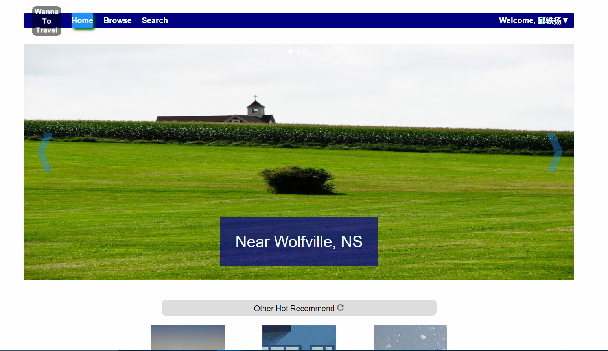
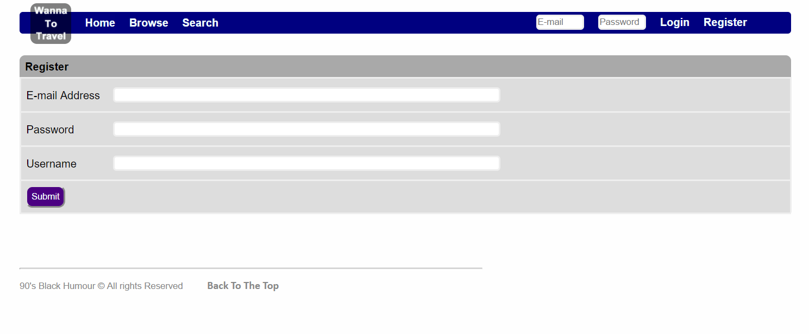
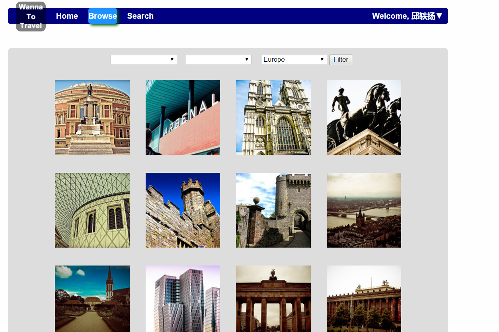
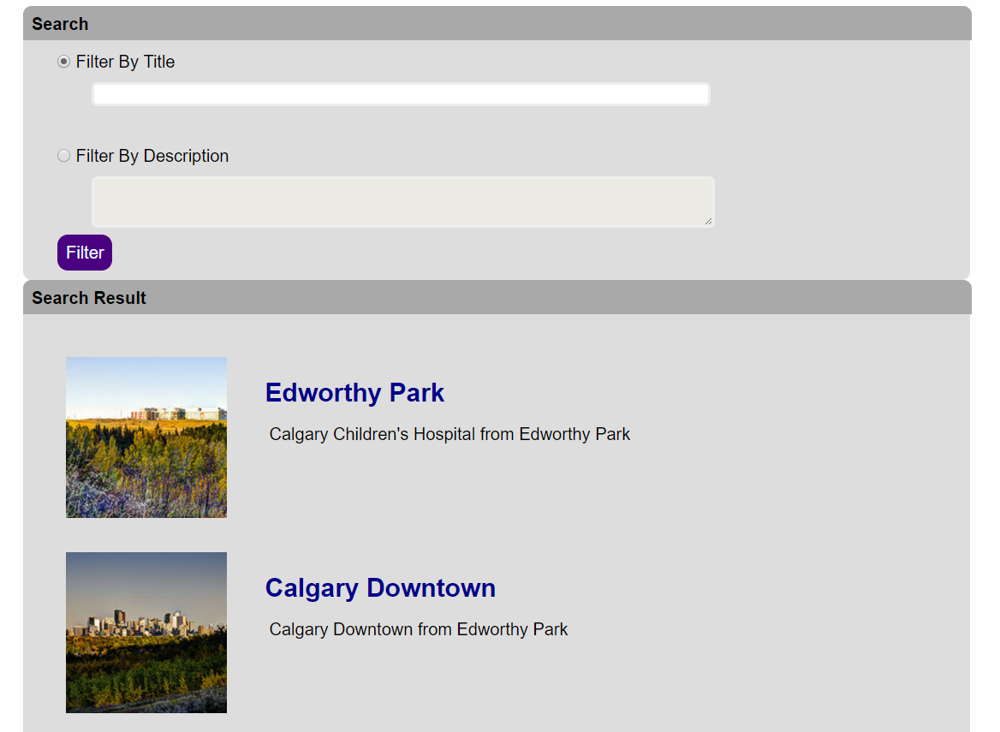
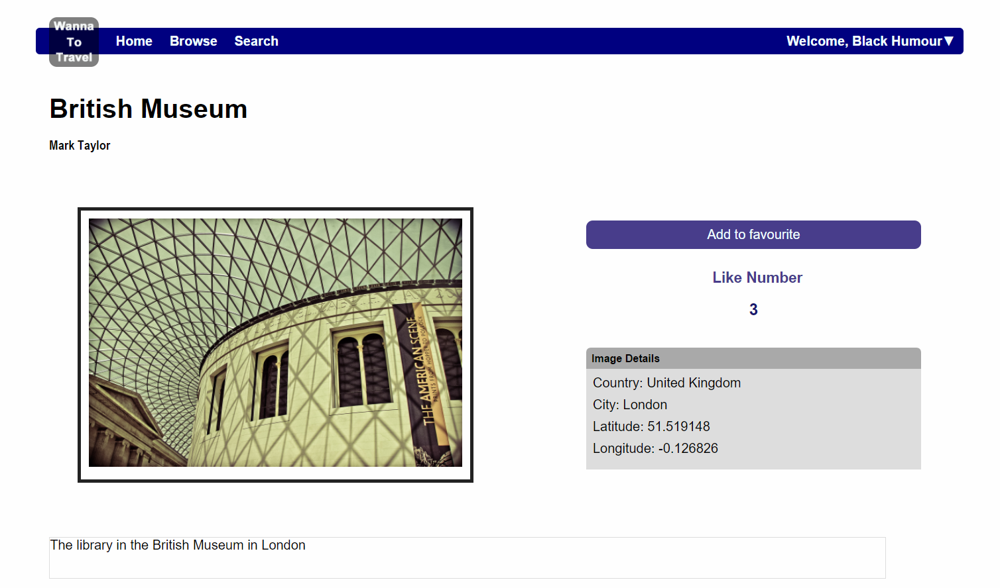
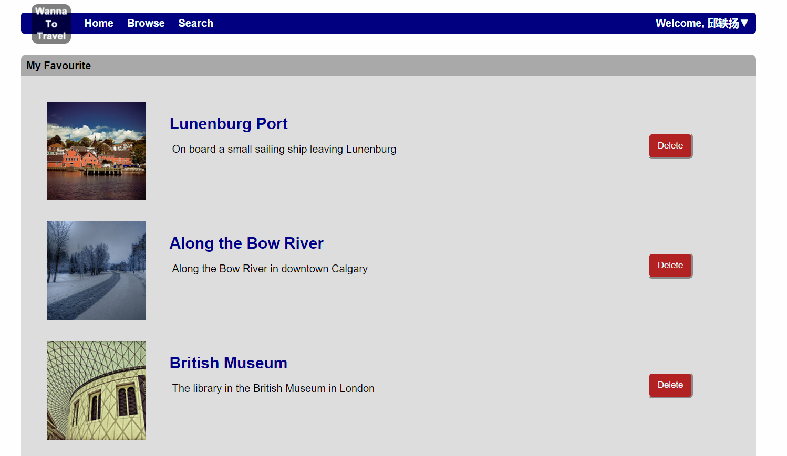
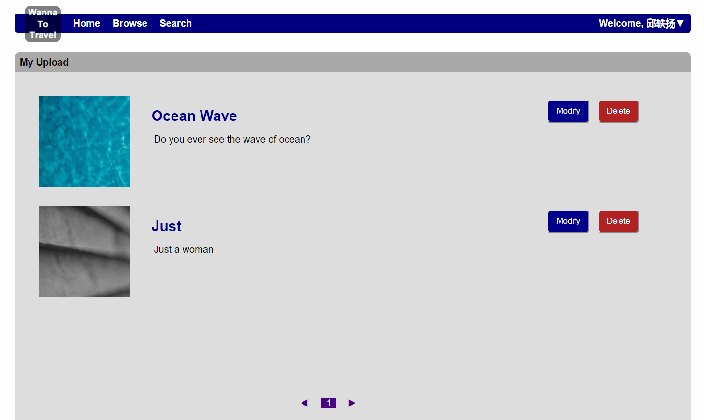
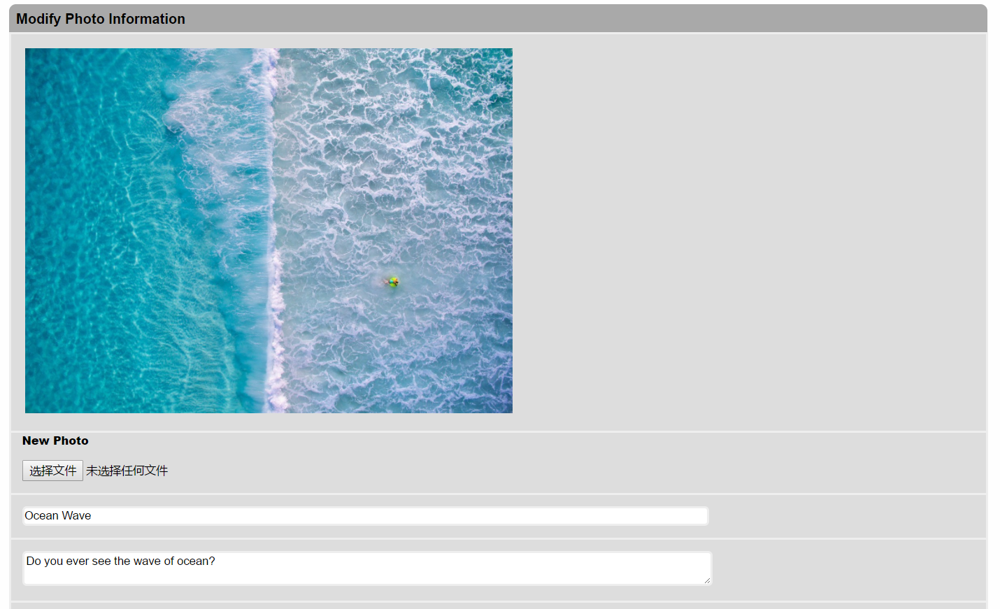

----------

Welcome to use Wanna To Travel
----------

Wanna To Travel 是一个旅行照片分享站点。所有人都可以将自己的图片上传分享给人们。

在所有页面中，您都可以点击图片查看图片的详细信息。

----------

##首页

这是进入Wanna To Travel的入口，在这个页面上您将看到最热门的图片以及最新上传的图片。点击“Other Hot Recommend”，您将刷新其他热门图片。点击“New Upload”可以刷新新上传图片

##登录

在导航栏右端，您将看见如图所示的登录区域。若您已经注册，只需在框中分别输入Email地址与密码，点击“Login”即可登录。若要注销，请点击右上角小箭头，在弹出菜单中点击“Logout”。

若您还未注册，请点击“Register”即可进入注册界面。

##注册

点击“Register”后您将看到如图页面。请在输入框中分别输入您用以注册账号的Email地址、密码以及用户名，然后点击“Submit”即可。

> **PS: 请输入正确的电子邮箱格式，密码位数不可低于7位，且三个输入框皆不得为空。**

##浏览

只需点击导航栏上的“Browse”，即可进入浏览页面。在浏览页中，您可以通过大洲、国家以及城市名对用户上传的图片进行筛选。只需通过下拉框对这些信息进行选择，然后点击“Filter”即可对图片进行筛选。筛选呈现区域下方有分页栏，可选择页码。

##搜索

当我们想要通过关键字来搜索图片时该怎么办呢？只要点击导航栏上“Search”，我们就可以进入搜索页面，对图片进行搜索。我们提供了两种搜索方式，即根据标题搜索与根据描述搜索。

当您选择了“Filter By Title”，您就可以在相应的文本框里输入关键字。然后点击“Filter”即可在“Search Result”中得到搜索的结果。当然，选择“Filter By Description”也是相同的操作方式。

##图片详细情况

点击任何一张图片都能进入相应的详细页面。在详细页面中，你将了解到这张图的名称，作者，描述，拍摄位置以及收藏数。同时，您可以在登录后，通过点击“Add to favourite”来收藏此图。已收藏的图片将显示在收藏页面。

##我的收藏

您可以在登录后通过点击页面右上角的小箭头，在弹出的菜单中选择“Favourite”进入收藏页面。其中将陈列您收藏的所有图片。点击“Delete”可以去除对其的收藏。

##上传图片

同样在弹出菜单中，您可以选择“Upload”来上传您的旅行图片。请务必详细输入所有的信息，否则将无法提交。

##我的照片

在弹出菜单中您还可以选择查看自己上传的照片，点击“My Photos”即可。

如想删除这一图片，可以点击“Delete”按钮，即可删除此图片。

如想对图片的信息进行修改，请点击“Modify”按钮，可跳转至修改页面，如下图所示。

您可以对图片信息以及图片本身进行修改。

**与世界一道，分享愉快**

